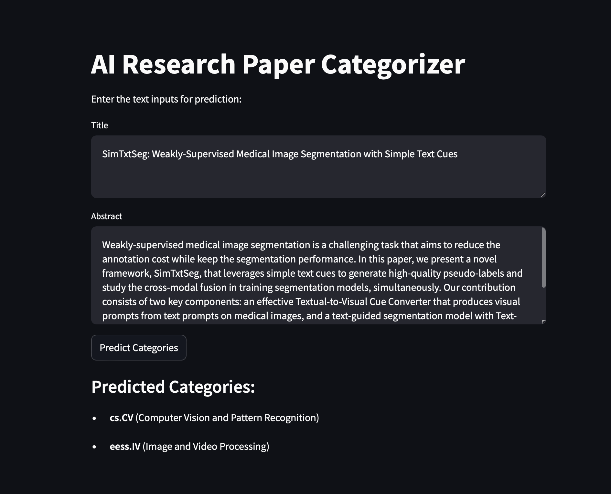

<h1 align="center">Automated Research Paper Classifier</h1>

  

# Table of Contents
- Basic Overview
- Demo
- Data Collection and Preprocessing
- Model Designing
- Results and Testing
- Deployment

# BASIC OVERVIEW :
* Contemporary paper submission platforms necessitate users to upload paper titles and abstracts, followed by the selection of appropriate categories for their submissions. However, the multitude of available categories poses a challenge for authors seeking optimal classification.
* This classifier is designed to perform **multi-label classification** to determine the appropriate research categories for a given paper based on its title and abstract. 

 # :floppy_disk:  DATA COLLECTION AND PREPROCESSING:
**DATASET LINK :** <https://www.kaggle.com/c/kriti-2024/data?select=train.csv> arXiv Dataset used .  
* It has **50000+ research papers Titles and Abstracts with its appropriate research categories** . 
* To Extract all the components of the text we replaced the 'Title' and 'Abstract' columns by a single column named 'context' which is the concatanation of the two columns.
#### PREPROCESSING:
* **Data Cleaning**:
  - URL Removal
  - Puncuation Removal
* **Text Tokenization**: Tokenization is used in natural language processing to split paragraphs and sentences into smaller units(words) that can be more easily assigned meaning. We have used a tokenizer to split the sentences into useful components. 
* **Sequence Padding**: The tokenized sequences are padded to ensure uniform length.
* **Word Embeddings**: Word2Vec embeddings are used to represent words in a continuous vector space where semantically similar words are mapped to nearby points. This captures the context of words in the research papers, providing rich word representations that are fed into the model.
  

# :pushpin:  Model Architecture :

* **Embedding Layer**: The embedding layer acts as a lookup table that maps words in the input sequences to their corresponding dense vector representations, initialized with pre-trained Word2Vec embeddings, which helps the model capture the semantic relationships between words more effectively.
* **LSTM Layers**: The core of the model is built using Long Short-Term Memory (LSTM) layers. LSTMs are a type of recurrent neural network (RNN) that are well-suited for sequential data and can capture long-range dependencies in the text. This makes them ideal for understanding the context and flow of information in research papers.
* **Dense Layers**: After the LSTM layers, dense (fully connected) layers are used to process the output and make final predictions. These layers are followed by an output layer with a sigmoid activation function for the 57-way multi-label classification.
* **adams optimizer**: Adaptive Moment Estimation is the technique used to update the gradient descent. Used for sparse data. 
* **categorical_crossentropy**: Categorical cross-entropy is used when true labels are one-hot encoded. Hence we use them. 

 
 
# :bar_chart:  RESULTS AND TESTING :

 
 

 
 

## Deployment

Deployed on Streamlit. Check it out! : https://automated-research-paper-categorizer.streamlit.app
